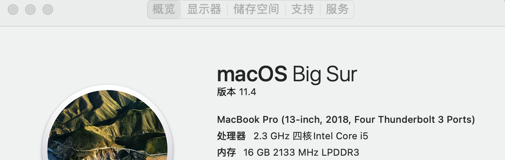
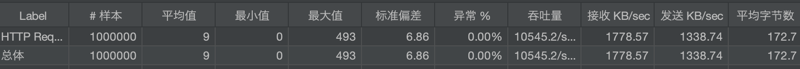

# badger-framework

A simple Netty Rpc
## Performance



## How To Use

### provider

```yaml
rpc:
  serviceName: badger-example
  port: 11311

zk:
  address: 127.0.0.1:2181
```

```java

@RpcProvider
public interface UserInfo {
    String echo(String str);
}

```

### consumer

```yaml
zk:
  address: 127.0.0.1:2181
```

```java

@RpcProxy(serviceName = "badger-example")
public interface UserInfo {
    String echo(String str);
}

```

assume you already have a local zookeeper.

```shell
start zookeeper
start provider 
start consumer 
curl http://127.0.0.1:8081/echo?str=abc
```

then you would get response:
echo from server abc

```jmx
jmeter -n -t rpcTest.jmx -l a -e -o b
```
## Kubernetes
assume you already install docker and kind.
```shell
# create a cluster with local registry
sh kind-with-registry.sh
sh deploy.sh
kubectl port-forward service/consumer 8080:8080
curl http://127.0.0.1:8081/echo?str=abc
```
## HAVE FUN!